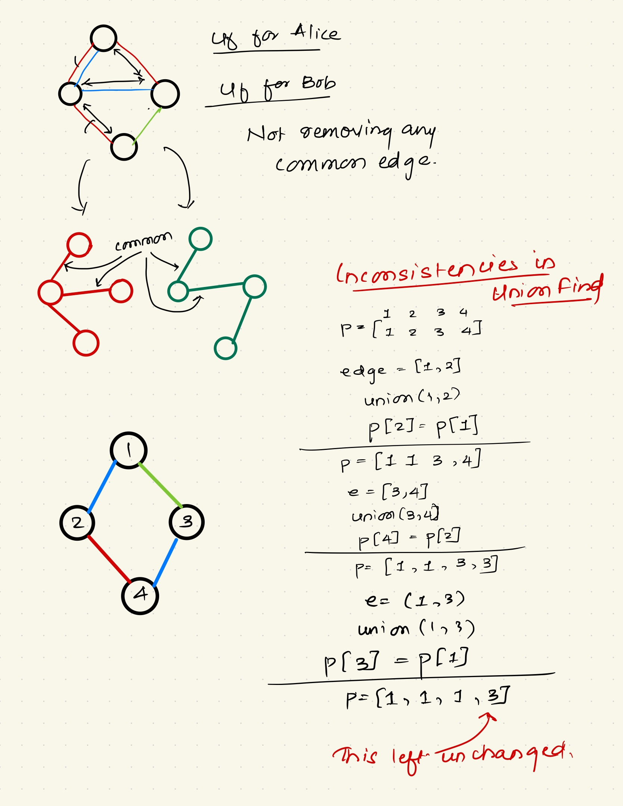

## Problem link: https://leetcode.com/problems/remove-max-number-of-edges-to-keep-graph-fully-traversable/description/

## Intuition:

- We can always use up all of the common edges.
- Later we can only count the edges we need for both alice and bob.
- In the end just check if the graph is connected or not.

## Notes:

- First connect with all type 3 edges.
- do not forget to store the copy of parent after this.
- Because while computing the parent for alice, it might change. --> Using the same parent means we might end up using Alice's edges for Bob which is not allowed.

- There are some inconsistencies in parent computation in union find. --> Best way to find the number of nodes in a component is by counting the number of edges. --> Not checking if all parents are same. (They wont be)

