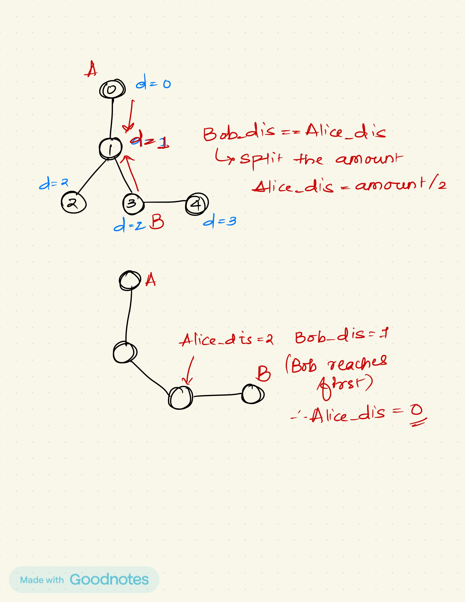

## Problem link: https://leetcode.com/problems/most-profitable-path-in-a-tree/description/

## Intuition: 

- If alice reaches a node later than bob, she gets nothing (poor alice)
- If they both reach at the same time, they split the amount in half.

## Notes:

- Find the min distance of each node from alice and also get the path from node 0 to any node
- We use the path to trace bob to node 0, while we are making comparisons
- Trace bob back to node 0, make comparisons and update amount
- Finally, add the cost for the max path from node 0 to any leaf node

