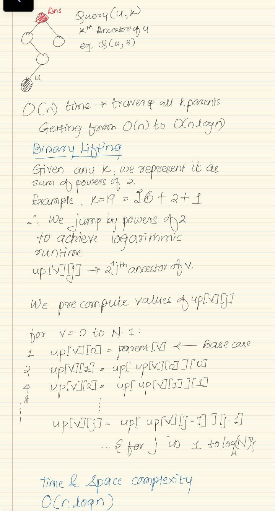

## Binary Lifting

This concept is similar to binary exponentiation where we use the binary representation of a number and skip the set bits to perform computation in log(n) time.
 
Why log(n)? -> A number has at most Log(n) + 1 bits in its binary representation.

There for a problem like finding the kth ancestor of a node, we store all the jth power of 2 ancestors of a particular node. 

Therefore we can find the kth ancestor of a node in log(k) time.

For eg. k = 13 => (1101)2 => 1 + 4 + 8
1, 4, 8 are the jumps we make to get to our ancestor node.

